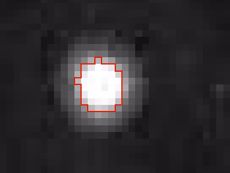

The objective of the project is to calculate the Boltzmann constant and Avogadro's number using image analysis of Brownian motion of particles.

The input data of our program is a set of videos of beads suspended in water. The Brownian motion of the beads can be used to calculate properties of matter, including Avogadro's number. The equations and experiment are based on work by Albert Einstein and Jean Baptiste Perrin.


Blob Finding
===


The first task is to identify distinct particles in the image. A particle is defined as a blob of adjacent pixels.



Thresholding
---

Since there is a large amount of noise in the image, thresholding is used to pick blobs out from the background. This very simple object identification technique selects pixels based on luminance being above a certain threshold value $\tau$.

In this program, the thresholding is performed as part of the same step is which the list of blobs is built, to save the overhead of calculating an intermediate image. *Note: performing thresholding to an array of booleans may actually provide a performance improvement.*

Blob detection/building
---

Blobs are detected by the `BlobFinder` class looping through the image, accessing each pixel sequentially. for each pixel, a `Blob` object is created, and a recursive blob-finding function
`_findBlob` is called. Once all blobs are found and stored, the function `getBeads` can be called to return a list of all blobs above a certain mass threshold.

*Note: inefficient to create `Blob` and call function for each pixel?*

### `_findBlob` function

The recursive function `_findBlob` is the main mechanism for building blobs from images. For each pixel, it first checks for a set of base cases:

* The location is outside the bounds of the image
* The location is already marked -- *i.e.* visited by a previous `_findBlob` function. This is important both so the function eventually exits, and to prevent double-counting of pixels and blobs
* The luminance of the pixel is below the threshold value `tau`. This means that the pixel is not in a blob.

If none of these exit conditions are met, the function marks the pixel as visited, adds the pixel to the `Blob` object it is working with, and recursively calls itself on each of the adjacent pixels with the same `Blob`, meaning that the adjacent pixels will be added to the same blob.

```python
self._findBlob(pic, tau, i + 1, j, marked, blob)  # South
self._findBlob(pic, tau, i, j + 1, marked, blob)  # East
self._findBlob(pic, tau, i, j - 1, marked, blob)  # West
self._findBlob(pic, tau, i - 1, j, marked, blob)  # North
```

### `Blob` class

The `Blob` class represents a group of pixels. The internal implementation of the class does not store a list of pixels, however, only the number of pixels, known as the mass, and the average positions, or the center of mass. However, these values are sufficient to describe the blob and can be updated to add new pixels.

The `Blob` class has three internal variables:

-----------  ----------- ---------------------------------
  `self._x`   $\bar{x}$  Center of mass *x* coordinate
  `self._y`   $\bar{y}$  Center of mass *y* coordinate
  `self._P`      $n$     Total mass/number of pixels
-----------  ----------- ---------------------------------

The center of mass of a blob with $n$ pixels, given their coordinates can be calculated by:

$$
\bar{x} = \frac{x_1+\ldots+x_n}{n}
$$
$$
\bar{y} = \frac{y_1+\ldots+y_n}{n}
$$

If a new pixel at $\langle x^\star, y^\star \rangle$ is added, the new center of mass is:

$$
\bar{x^\star} = \frac{x_1 + \ldots + x_n + x^\star}{n+1}
$$
$$
\bar{y^\star} = \frac{y_1 + \ldots + y_n + y^\star}{n+1}
$$

*Note: need better symbol for new than $\star$.*

We can calculate the new center of mass without knowing the previous x values, however. The only values we need are $\bar{x}$, $\bar{y}$, and $n$.

The sum of the coordinates of the previous points can be obtained by multiplying the old average by the old mass:

$$
x_1 + \ldots + x_n = n \bar{x}
$$
$$
y_1 + \ldots + y_n = n \bar{y}
$$

The new average can then be fairly easily computed:

$$
\bar{x^\star} = \frac{n \bar{x} + x^\star}{n+1}
$$
$$
\bar{y^\star} = \frac{n \bar{y} + y^\star}{n+1}
$$

This equation is implemented in the `Blob.add` method:

```python
def add(self, i, j):
        """
        Adds pixel (i, j) to this blob.
        """

        oldx = self._P * self._x
        self._x = (oldx + i) / (self._P + 1)

        oldy = self._P * self._y
        self._y = (oldy + j) / (self._P + 1)

        self._P += 1
```

### Beads

Only blobs above a certain mass threshold are considered by the blob tracker. This means that background noise will not be falsely considered as a blob. Any blob above the mass threshold is considered to be a bead.

Calculation
===

The equations for calculating values are:

$$
D = \sigma^2 = \frac{r_1^2 + \ldots + r_n^2}{2n}
$$

...